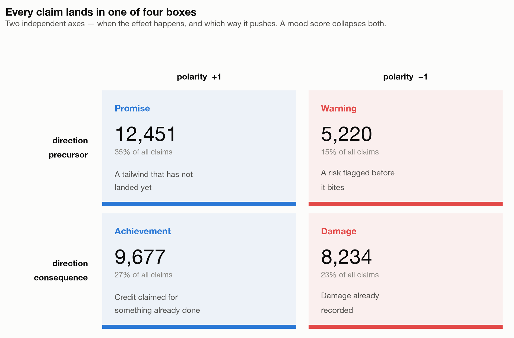
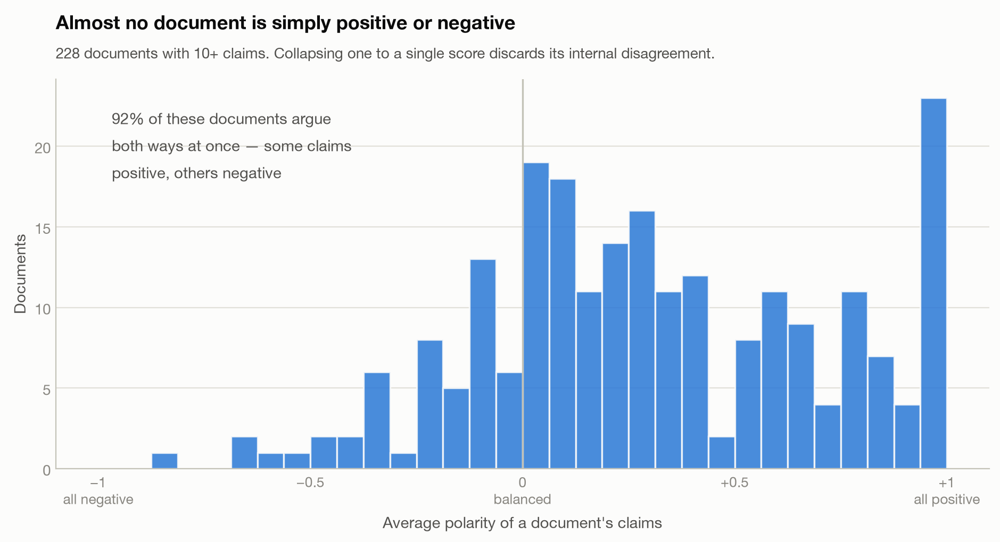
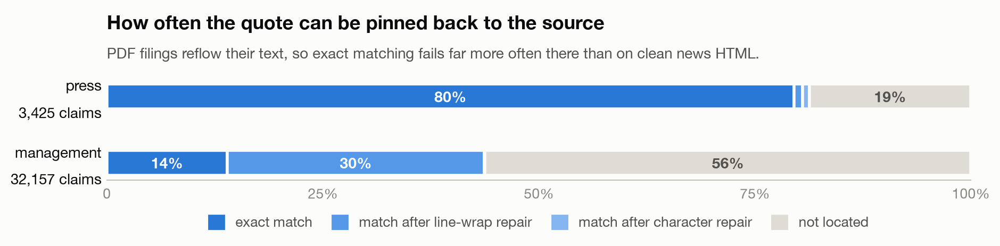
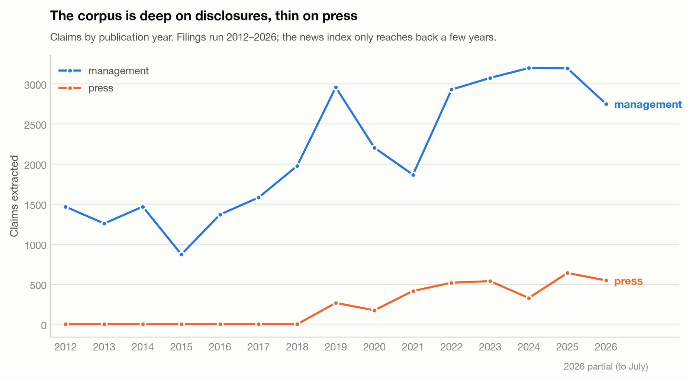

# Causal Claims from EU Large-Cap Disclosures and Press

**35,582 typed, signed causal claims** extracted with an LLM from 567 corporate documents and
news articles about five European large-caps — Michelin, L'Oréal, Sanofi, LVMH and
TotalEnergies — spanning **2012–2026**.

Each claim is a **PTC** (Point To Correlate): a mechanism, the direction of its effect in time,
the sign of that effect, when it was published, and — for 47% of rows — the exact character
offsets of the passage it came from.

Built with [`ptc-extract`](https://github.com/tomPrdd/ptc-extract).

## Read this first

This dataset was built to test whether the causal stories a company and its press tell predict
its share price. **That hypothesis failed.** The extracted `polarity` does not predict the
direction of subsequent abnormal returns; the apparent significance in early versions came from
a mis-specified benchmark, non-independent observations and uncorrected multiple testing.

That is stated here rather than buried, because anyone downloading this to try the same thing
deserves to know it has been tried. The extraction layer is a separate question from what the
claims were used for, and it stands on its own.

## What a claim looks like

`direction` and `polarity` are independent, and that is the whole point of the schema. Together
they sort every claim into four kinds of statement that a single sentiment score would flatten
into one number:



The quadrant names are descriptive, not fields — but they are what the two axes mean in
practice. Note the asymmetry: claims about the future are **70.5% positive**, claims about the
past **54.0%**. Forward-looking statements in this corpus are markedly more optimistic than
backward-looking ones, which is worth accounting for before you treat `polarity` as a neutral
measurement.

The corpus also disagrees with itself constantly. Averaging each document's claim polarities —
roughly what a document-level sentiment model reports — gives this:



**91.7%** of documents with ten or more claims contain both positive and negative claims, and
65.8% contain all four quadrants. The claim-level structure is the signal here; any
document-level aggregate throws most of it away.

## Quickstart

```python
from datasets import load_dataset

claims  = load_dataset("tomPrdd/ptc-pool-eu-largecap")                 # ~4 MB
vectors = load_dataset("tomPrdd/ptc-pool-eu-largecap", "embeddings")   # ~130 MB, opt in
docs    = load_dataset("tomPrdd/ptc-pool-eu-largecap", "documents")    # ~26 MB, opt in
```

### Resolving a span

`span_start` / `span_end` index the **extracted text in the `documents` config**, not the
source PDF's bytes. With that config the corpus is self-contained:

```python
text = {d["source_id"]: d["text"] for d in docs["train"]}
c = claims["train"][0]
assert text[c["source_id"]][c["span_start"]:c["span_end"]] == c["raw_text"]
```

All **14,077** management claims that carry a span resolve exactly this way, verified at build
time. Press spans are present but **not resolvable** — the articles they index are third-party
journalism and are not distributed here.

Join on `content_hash`, which is unique across the dataset.

Or with the library, which validates every row against the schema and drops-and-counts failures:

```python
from ptc_extraction.hub import load_pool_from_hub

ptcs = load_pool_from_hub(
    "tomPrdd/ptc-pool-eu-largecap",
    filters={"source_type": "management", "direction": "precursor"},
)
```

## Schema

| Column | Type | Notes |
|---|---|---|
| `content_hash` | string | Unique row id, join key to `embeddings` |
| `mechanism` | string | One-sentence causal statement, in the model's words |
| `raw_text` | string | Source passage. **Null on all press rows** — see Licensing |
| `direction` | string | `precursor` (effect ahead) / `consequence` (already realised) |
| `polarity` | int8 | `+1` / `-1` — claimed direction of the effect |
| `source_date` | string | Publication date. The anchor for all time-based analysis |
| `event_date` | string | When the underlying event occurred. **Null on 21.0%** — see Missing values |
| `event_date_raw` | string | Original value before nulling; null where the model gave none |
| `event_date_suspect` | bool | Gap > 10 years from `source_date`. True on 323 rows |
| `source_type` | string | `management` / `press` |
| `source_id` | string | Source document identifier |
| `span_start`, `span_end` | int64 | Character offsets of `raw_text` in the document. **Null on 52.6%** |
| `span_match` | string | `verbatim` / `whitespace` / `unicode` — see Spans. Null iff no span |
| `extracted_by` | string | Model. **Confounded** — see Provenance |
| `extraction_version` | string | Uniformly `v1.1` |
| `confidence` | float64 | Model self-report. Piles up at 0.9; treat with suspicion |
| `ticker`, `company_name`, `sector` | string | Which company's corpus this came from |
| `language` | string | Of `raw_text`. `mechanism` is always English |
| `source_doc_names_focal` | bool | **The topicality filter.** Always true for management |
| `focal_company_mentioned` | bool | Whether the *claim text* names the company — informational only |
| `mechanism_near_copy` | bool | Press mechanism ≥0.8 Jaccard with its source passage |
| `ambiguous_source` | bool | `source_id` maps to two documents (188 rows) |
| `near_dup_group` | int32 | Near-duplicate cluster (cosine ≥0.95, within ticker). Null = not clustered (82.6%) |
| `split` | string | Document-grouped train/validation/test |

### `documents` config

144 management documents, 80.0 M characters, 26 MB compressed — the extracted text every span
indexes into.

| Column | Type | Notes |
|---|---|---|
| `source_id` | string | Join key to the claims config |
| `ticker`, `source_type`, `source_date` | string | |
| `n_chars` | int64 | Length of `text` |
| `text` | string | Pipeline-extracted text, byte-identical to what spans were computed against |

The source PDFs are deliberately **not** shipped: an offset into extracted text cannot be
resolved against a PDF's bytes without reproducing the exact extraction, so the text is what
makes the offsets usable. The original filings remain available from each company's
investor-relations site.

## Missing values

Null is common here and never means "corrupt". Each one has a specific cause, and the rate
differs sharply by corpus — check before you assume a column is dense.

| Column | Null | management | press | What null means |
|---|---:|---:|---:|---|
| `raw_text` | 9.6% | 0% | **100%** | Deliberately stripped from press — see Licensing |
| `span_*` | 52.6% | **56.2%** | 18.7% | The passage could not be located — see below |
| `event_date` | 21.0% | 20.9% | 21.9% | The claim never said when |
| `near_dup_group` | 82.6% | 81.5% | 92.3% | Row is in no near-duplicate cluster |

**`event_date` is absent far more often than it is wrong.** 7,382 rows are null simply because
the claim states a mechanism without dating the event — "raw material costs pressured margins"
carries no date of its own. A further **76** rows had a value that was implausible and was
nulled; `event_date_raw` preserves what the model originally said, so those 76 are the rows
where `event_date` is null and `event_date_raw` is not. Separately, `event_date_suspect` flags
**323** rows more than 10 years from `source_date` — flagged, not removed, because a genuine
claim about a decade-old event is legitimate. Use `source_date` as your time anchor; it is
never null.



**No span does not mean no evidence.** Spans are *computed*, never requested from the model —
asking an LLM for character offsets produces confident fiction. The pipeline locates `raw_text`
in the source document under three matchers; null means none of them found it, which happens
when the model paraphrased instead of quoting, or when PDF text extraction reflowed the passage
past what the matchers tolerate. `raw_text` itself is still there and still faithful. The
asymmetry is the giveaway: management is **56.2%** null against press's 18.7%, because
management text comes from PDFs with column breaks and hyphenation while press text arrives as
clean HTML. Filter on `span_match.is_not_null()` when you need offsets; do not treat the
remainder as lower-quality claims.

## Coverage



The two corpora are not comparable in size or in reach. Company filings span 2012–2026;
press coverage effectively starts in 2019, because the free news index behind it does not
reach further back. **90.4% of all claims are the companies' own words** — treat this as a
dataset of corporate self-description that happens to include some journalism, not as a
balanced two-corpus comparison. The optimism asymmetry noted above is therefore mostly a
statement about how companies write about themselves.

Volume also tracks how much a company publishes, not how eventful it was: Sanofi contributes
11,089 claims and L'Oréal 2,092. Normalise before comparing issuers.

## Known limitations

**Some press rows are off-topic.** The press corpus came from a keyword news index, which swept
in articles that only glance at the company — or miss it entirely. `source_doc_names_focal` is
the deterministic test: does the **source article** name the company it was fetched for?

| | Rows | |
|---|---:|---|
| Press claims from an article naming the focal company | 2,951 | 86.2% |
| **Press claims from an article that never names it** | **474** | **13.8%** |

Those 474 rows are **1.3% of the dataset**. To exclude them:

```python
claims = claims.filter(lambda r: r["source_doc_names_focal"])   # keeps 35,108 of 35,582
```

`focal_company_mentioned` — whether the *claim text* names the company — is **not** a usable
filter and is provided only for information. An on-topic claim usually says "the Group expects
margins to compress" rather than repeating the company name, so that test rejects 83% of
perfectly good rows. The document is where the evidence lives, not the sentence.

**Attribution itself is never in doubt.** `ticker` / `company_name` record which company's
corpus a claim was extracted from, derived deterministically from `source_id`. The only open
question is topical relevance for press, answered by the column above.

**Model provenance is confounded.** 99% of rows come from Amazon Nova Pro; the 360 Sonnet 4.6
rows are all Michelin press from the original pilot. `extracted_by` is therefore *not* a
randomised comparison — model is confounded with both company and corpus.

**Spans are exact, but only `verbatim` guarantees string equality.** 16,862 rows (47.4%) carry
offsets — the other 52.6% are null for the reasons given under Missing values. Of those that
do: `verbatim` 7,201, `whitespace` 9,609, `unicode` 52. All three locate the passage
correctly, but only `verbatim` satisfies `document[start:end] == raw_text` byte for byte — the
others differ by PDF line wrapping or typographic characters. Filter to `verbatim` if your code
assumes equality. Offsets index the *pipeline-extracted text* of the document, not raw PDF bytes.

**Splits are document-grouped, deliberately.** Documents yield 1 to 991 claims, so a
claim-level split would leak near-identical claims across the boundary. No `source_id` appears
in more than one split, and the assignment is stratified by ticker and corpus. This is why the
splits ship pre-computed: a random 80/10/10 over 35,582 rows silently inflates every score.

They are a default, not a constraint. To ignore them and cut your own — but group by
`source_id` if you do:

```python
everything = load_dataset("tomPrdd/ptc-pool-eu-largecap", split="train+validation+test")
```

The `split` column travels with each row, so the original assignment survives the merge.

**Near-duplicates are kept, not removed.** 6,209 rows sit in a `near_dup_group`. Repeated
mentions are meaningful signal for frequency analysis; drop them only if your task needs
independence.

**Recall is unmeasured.** Validation catches malformed claims, but a claim the model *missed*
is invisible. There is no hand-labelled ground truth.

**Not investment advice.**

## Licensing

**CC BY 4.0**, covering the annotation layer — the schema, `mechanism`, `direction`,
`polarity`, the dates and every derived column. That layer is original work.

The underlying documents are not:

- **Management rows keep `raw_text`.** These are the companies' own published regulatory
  filings — documents issuers publish precisely so they are read and quoted. `source_id`
  attributes each passage.
- **Press rows have `raw_text` stripped** (all 3,425). Those are third-party news articles and
  are not redistributed here in any form. `mechanism` is retained as an LLM reformulation, and
  the 698 press mechanisms that are near-copies of their source passage are flagged with
  `mechanism_near_copy` so you can exclude them.

## Provenance

Extracted with [`ptc-extract`](https://github.com/tomPrdd/ptc-extract) using Amazon Nova Pro on
Bedrock, prompt version `v1.1`. Embeddings are Amazon Titan Embed v2 (1024-dim) — tied to that
specific model and not comparable with vectors from another. Total extraction cost ≈ $40.

Source documents: the investor-relations pages of the five companies (management) and the
GDELT news index (press).
